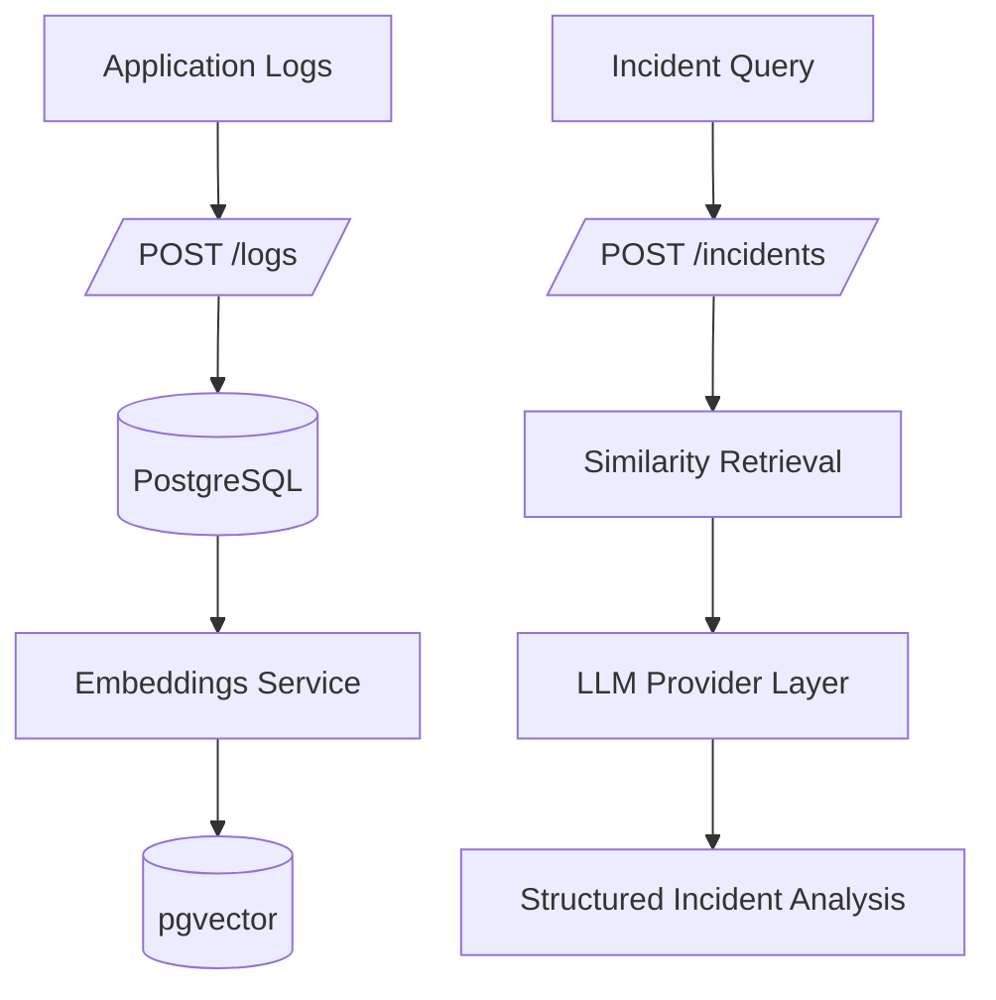
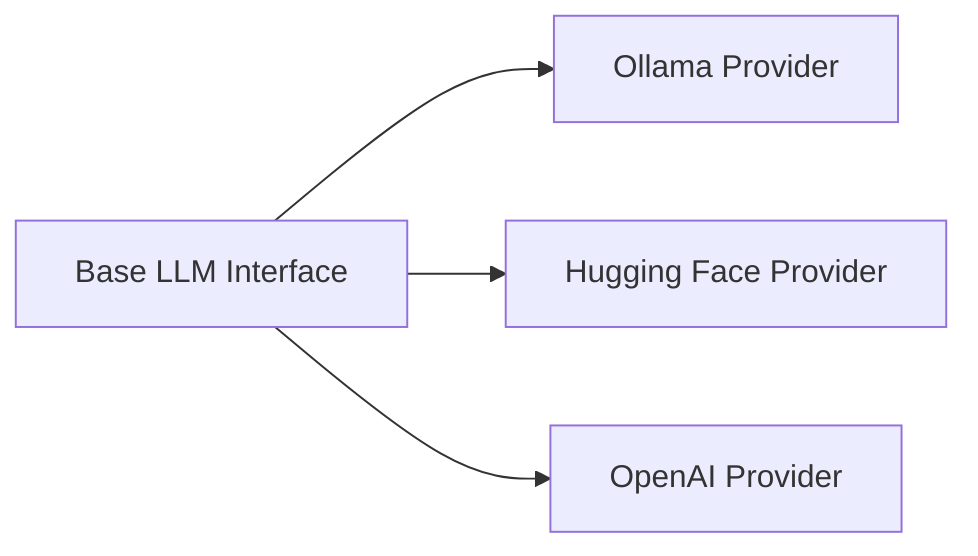

# AI Incident Investigation System

An intelligent incident investigation platform that turns noisy operational logs into actionable root-cause analysis.

## Why This Project Exists

Modern production systems generate thousands of logs per minute, but incident responders still lose time in repetitive manual work:

- finding relevant logs across services
- correlating traces and failures
- forming a reliable root-cause hypothesis under pressure

This project solves that by combining vector retrieval and LLM reasoning into a focused incident workflow.

## What Problem It Solves

Given an incident query such as `payment timeout during checkout`, the system can:

- ingest and embed logs automatically
- retrieve semantically related logs from PostgreSQL + pgvector
- generate structured incident analysis with evidence and next checks
- compare output quality across multiple LLM providers

## How It Is Different

Compared with a plain log dashboard or keyword search tool, this system provides:

- semantic retrieval: meaning-based similarity, not just exact text matching
- provider abstraction: Ollama, Hugging Face, and OpenAI through a shared interface
- side-by-side comparison: evaluate multiple providers in one request (`/llm/compare`)
- incident-focused output: structured root cause, confidence, evidence, and next steps

## What Is Unique

- multi-provider RAG incident analysis in a lightweight FastAPI service
- practical reliability layer: retries/backoff for transient LLM/API failures
- local-first plus cloud-flexible AI strategy (Ollama + external providers)
- dual CI/CD style in one repo: GitHub Actions (fast checks) + Jenkins (deeper flow)
- built-in observability and caching for realistic production behavior

## Interactive Tour

<details>
<summary><strong>System Flow (Click to Expand)</strong></summary>



</details>

<details>
<summary><strong>Provider Layer (Click to Expand)</strong></summary>



</details>

## Tech Stack

| Area | Technology |
|---|---|
| API | FastAPI, Uvicorn |
| Data Layer | PostgreSQL, SQLAlchemy, psycopg |
| Vector Search | pgvector |
| Embeddings | sentence-transformers (`all-MiniLM-L6-v2`) |
| LLM Providers | Ollama, Hugging Face Router API, OpenAI Chat Completions |
| Caching | Redis |
| Metrics & Monitoring | Prometheus, Grafana |
| Testing | pytest (unit + integration) |
| Quality | flake8, black |
| CI/CD | GitHub Actions, Jenkins |
| Containers | Docker, docker-compose |

## Core Endpoints

- `GET /health` - service health
- `POST /logs` - ingest log with embedding pipeline
- `GET /logs/similar` - semantic retrieval
- `POST /incidents` - incident analysis from related logs
- `POST /llm/test` - provider smoke check
- `GET /llm/model/check` - model availability check
- `POST /llm/compare` - compare providers in one request
- `GET /metrics` - Prometheus metrics

## Quick Start

```powershell
make install
make db-up
make cache-up
make run
```

Open:

- `http://127.0.0.1:8000/health`
- `http://127.0.0.1:8000/docs`

## Try It: Simulate Realistic Logs

```powershell
make simulate-logs
```

This generates realistic multi-service incidents (payment timeout, auth outage, db saturation) through `/logs`.

## Documentation Map

- [Architecture](docs/ARCHITECTURE.md)
- [Project Structure](docs/STRUCTURE.md)
- [Frontend UI Guide](web/README.md)