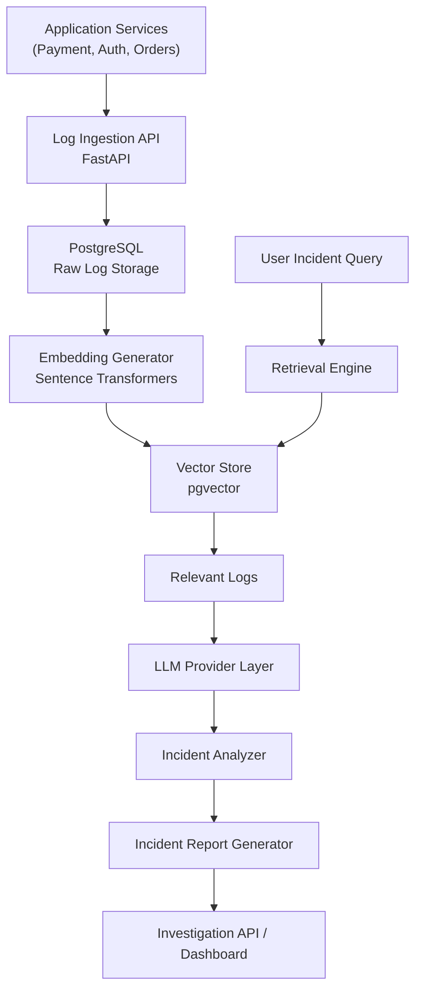
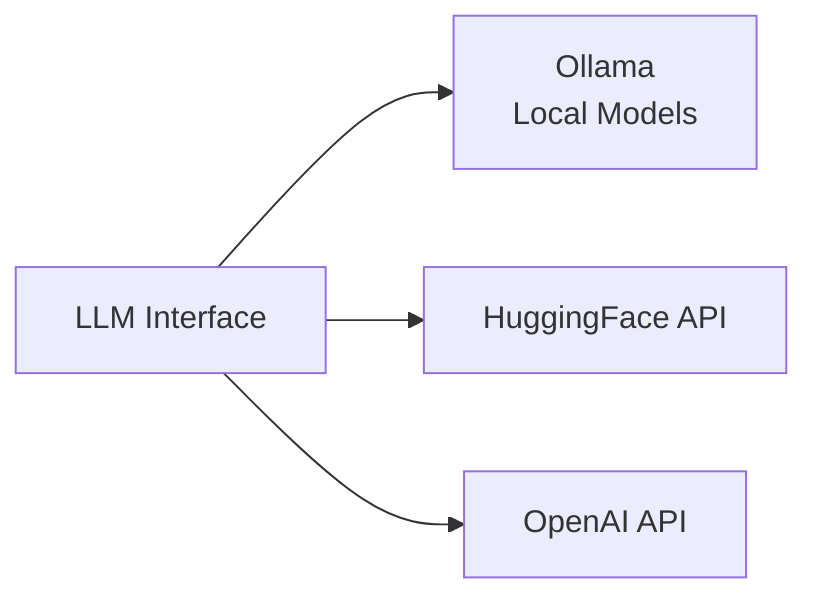
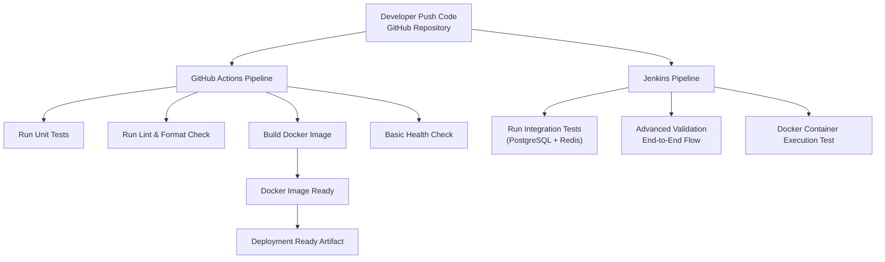
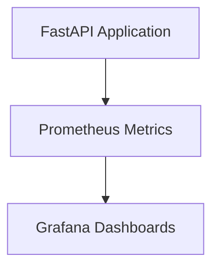

# AI Incident Investigation System — Architecture

## High-Level System Architecture



---

## LLM Provider Layer (Abstraction)



---

## CI/CD Architecture



---

## CI/CD Responsibility Separation

### GitHub Actions (Fast Feedback)

- Triggered on every push / PR
- Runs:
  - Unit tests
  - Lint checks (flake8, black)
  - Docker build
  - Basic health checks

Purpose:

- Quick validation
- Developer feedback
- Prevent broken commits

---

### Jenkins (Deeper Validation)

- Triggered via webhook or manually
- Runs:
  - Integration tests (DB + Redis)
  - End-to-end system tests
  - Container runtime validation

Purpose:

- Simulate production environment
- Validate system reliability
- Advanced pipeline control

---

## Observability Layer



Metrics Collected:

- Log ingestion rate
- Query latency
- LLM response time
- Error rates

---

## Data Flow Summary

```text
Logs → Ingestion API → PostgreSQL → Embeddings → pgvector
→ Retrieval → LLM → Incident Analysis → Report Generation
```

---

## CI/CD Flow Summary

```text
Code Push → GitHub Actions (fast checks)
         → Jenkins (deep validation)
         → Docker Image → Deployment Ready
```

---

## Key Engineering Highlights

- Distributed log processing pipeline
- AI-powered root cause analysis
- Vector similarity search using pgvector
- LLM abstraction supporting multiple providers
- Dual CI/CD pipelines (GitHub Actions + Jenkins)
- Observability with Prometheus and Grafana
