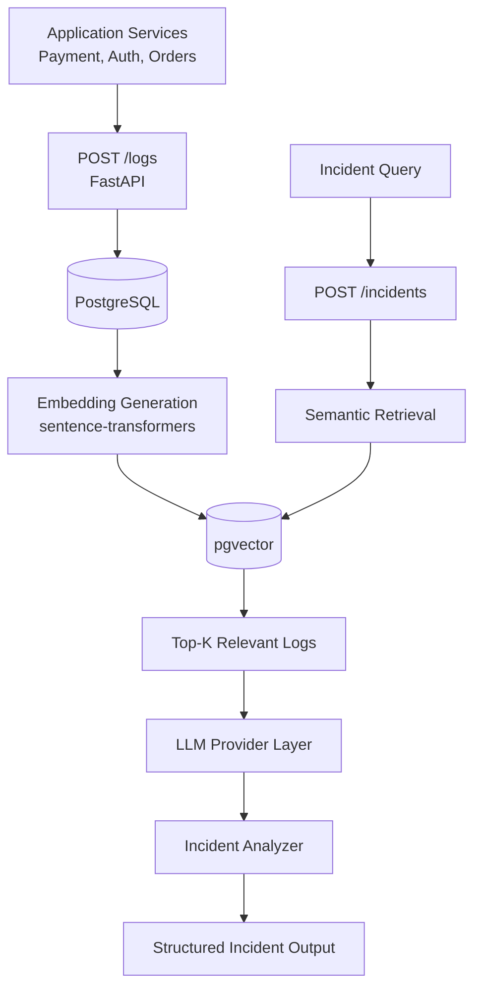
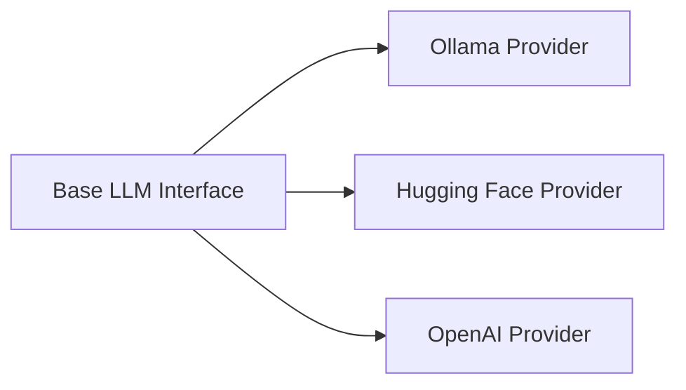
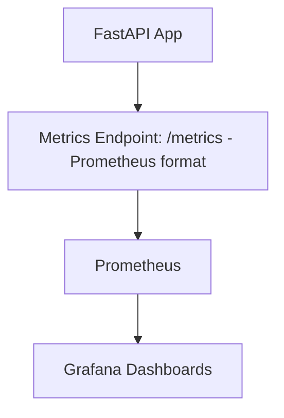
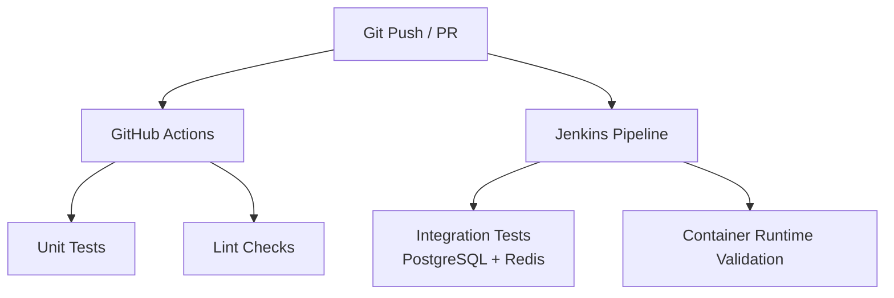

# AI Incident Investigation System — Architecture

## 1) Problem and Architecture Goal

### Problem

In incident response, teams often spend too much time answering three questions:

- Which logs actually matter?
- What is the most likely root cause?
- What should be checked next?

### Goal

Provide a production-oriented architecture that transforms raw logs into structured incident analysis with evidence, confidence, and next checks.

## 2) End-to-End Architecture


```mermaid
flowchart TD

Apps[Application Services<br/>Payment, Auth, Orders] --> Ingest[POST /logs<br/>FastAPI]
Ingest --> DB[(PostgreSQL)]
DB --> Embeddings[Embedding Generation<br/>sentence-transformers]
Embeddings --> Vector[(pgvector)]

Query[Incident Query] --> IncidentAPI[POST /incidents]
IncidentAPI --> Retrieve[Semantic Retrieval]
Retrieve --> Vector
Vector --> Evidence[Top-K Relevant Logs]

Evidence --> LLM[LLM Provider Layer]
LLM --> Analyzer[Incident Analyzer]
Analyzer --> Report[Structured Incident Output]
```

## 3) LLM Provider Abstraction


```mermaid
flowchart LR
Base[Base LLM Interface] --> Ollama[Ollama Provider]
Base --> HF[Hugging Face Provider]
Base --> OpenAI[OpenAI Provider]
```

### Why this matters

- provider swap without route/service rewrites
- model experiments with the same API contract
- compare outputs with `/llm/compare`

## 4) Key Design Differences

Compared with a generic logging platform, this architecture is intentionally incident-first:

- semantic retrieval over exact keyword-only matching
- AI analysis constrained by retrieved evidence
- structured analysis output format for operational decisions
- provider-level resilience via retry/backoff on transient failures

## 5) What Is Unique Here

- local and cloud model strategy in one system (Ollama + HF + OpenAI)
- explicit model availability checks and provider comparison endpoints
- cache-aware retrieval/analysis path with graceful degradation
- practical observability and CI/CD layers integrated into the same developer workflow

## 6) Observability Architecture


```mermaid
flowchart TD
App[FastAPI App] --> Metrics[Metrics Endpoint: /metrics - Prometheus format];
Metrics --> Prom[Prometheus];
Prom --> Grafana[Grafana Dashboards];
```

Tracked signals include:

- ingestion request volume and latency
- retrieval and analysis latency
- provider error patterns
- endpoint-level success/failure behavior

## 7) CI/CD Architecture


```mermaid
flowchart TD
Code[Git Push / PR] --> GHA[GitHub Actions]
Code --> Jenkins[Jenkins Pipeline]

GHA --> Unit[Unit Tests]
GHA --> Lint[Lint Checks]

Jenkins --> Integration[Integration Tests<br/>PostgreSQL + Redis]
Jenkins --> Runtime[Container Runtime Validation]
```

### Responsibility split

- GitHub Actions: quick feedback loop
- Jenkins: deeper environment-like verification

## 8) Technical Components

| Layer | Tech |
|---|---|
| API | FastAPI, Uvicorn |
| ORM/DB | SQLAlchemy, PostgreSQL, psycopg |
| Vector | pgvector |
| Embeddings | sentence-transformers |
| LLM | Ollama, Hugging Face Router API, OpenAI Chat Completions |
| Cache | Redis |
| Metrics | prometheus-client, Prometheus, Grafana |
| Quality | pytest, flake8, black |
| Delivery | Docker, GitHub Actions, Jenkins |

## 9) Runtime Data Path (Summary)

```text
Logs -> Ingestion -> PostgreSQL -> Embeddings -> pgvector
Incident Query -> Retrieval -> LLM -> Structured Analysis
```
