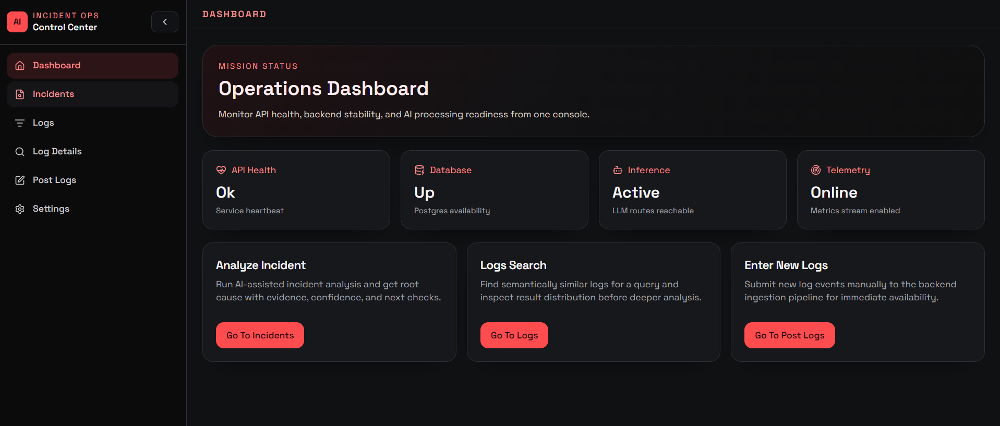
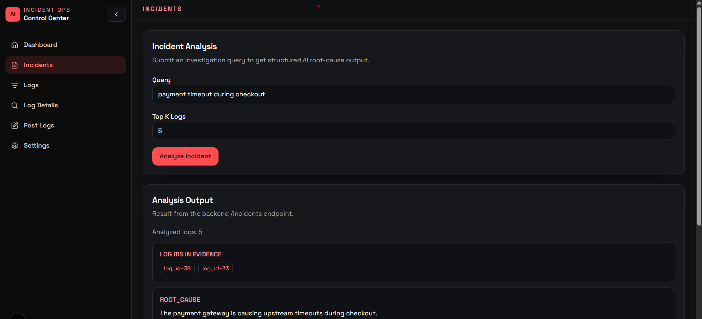
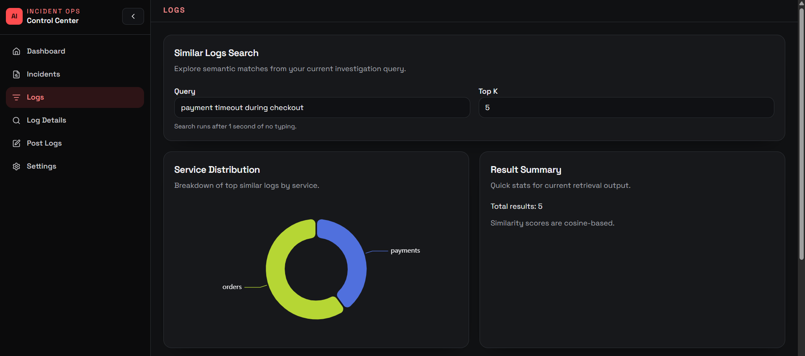
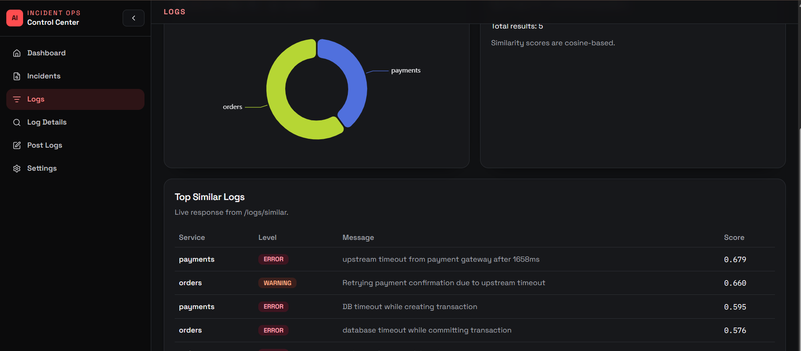
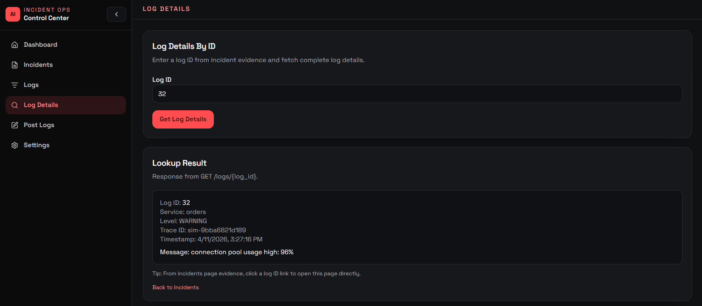
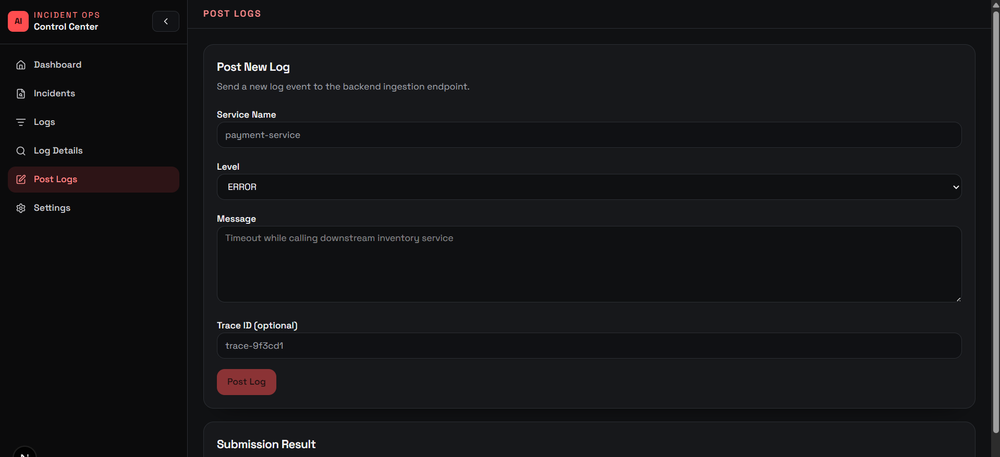

# AI Incident Investigator UI

Next.js frontend for the AI Incident Investigation System backend.

## Stack

- Next.js (App Router) + TypeScript
- Tailwind CSS
- shadcn-style UI primitives (`src/components/ui`)
- TanStack Query
- Zustand
- ECharts

## Run

1. Install dependencies:

```bash
npm install
```

2. Configure backend URL:

```bash
cp .env.local.example .env.local
```

3. Start the app:

```bash
npm run dev
```

Frontend runs at `http://localhost:3000`.

## Environment

- `NEXT_PUBLIC_API_BASE_URL`: backend API root (default `http://127.0.0.1:8000`)

## Main Features in Starter UI

- API and DB health status
- Incident analysis with structured output sections
- Similar log retrieval with 1-second typing debounce
- Log details lookup by ID (`/log-details`)
- Post new log entry form (`/post-logs`)
- Service distribution chart over similarity results

## UI Screenshots

The section below includes screenshots for key pages. Current files are placeholders and can be replaced with actual captured screenshots while keeping the same filenames.

### Dashboard



### Incident



### Logs




### Log Details



### Post Logs



